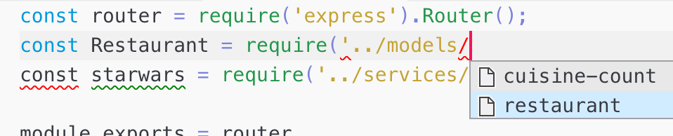
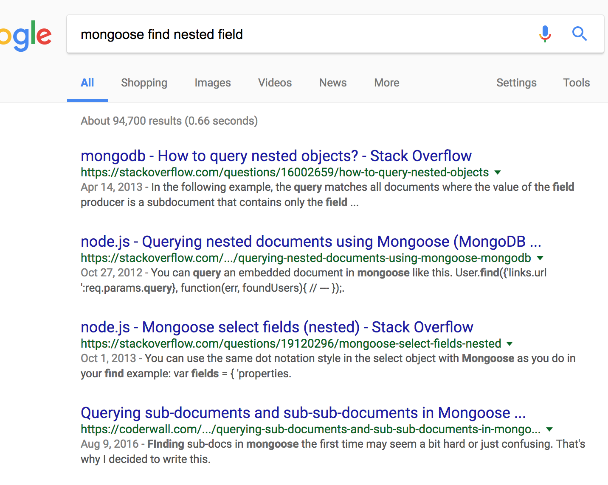

Resolving Technical Issues
===

## Preventing Errors

There are many, many tools, processes and practices we use to help avoid common
errors.

1. Have `eslint` running and **stop immediately** and remedy both 
errors and warnings. Use `disable-line` to indicate what you are doing is
intentional and exceptional. Do *not* use `disable-line` simply to make an
error or warning go way.
1. Use VSCode `require` matching to verify you are entering correct path:
    > 
1. Read the `README.md` from the class for the relevant topic, most critical
setup or usage issues have been highlighted.
1. Use `TAB` when typing paths on the command line to verify you are matching
an actual folder or file.

## Dealing with Errors

### Read the Error

Read through **the entire error**:
1. Determine whether there is one error or a series of errors. Use `.only` to reduce the amount of information if you are experiencing many errors.
1. Find the **specific error message**. Often this will tell you __exactly__ what the problem is. Most problems have been experienced by other developers, so if the error is unclear, **google the exact error**.
1. Find **the line number and file in your code** where the error is occurring. The error may be in another library and you need to go through the call stack to 
find where was the last line of your code before the error.

### Debug

Debugging enables you to inspect running code to see what the values of variables are at any given moment.
1. Put the breakpoint **exactly** on the line of code you want to inspect.
1. With asynchronous JavaScript, you **must** put the breakpoint in the asynchronous function you want to debug, not the code to which the asynchronous function is being passed:
    ```js
    app.get('/:id', (req, res, next) => {  // (A)
        Model.findById(req.params.id) // (B)
            .lean()
            .then(model => {
                res.send(model); // (C)
            });
    });
    ```
    * `(A)` Breakpoint here will stop when the handler is being registered with
    express. It won't stop and you can not step to when a request happens!
    * `(B)` Breakpoint here will stop for each request and will allow you to inspect
    the value of `id` param. It won't stop and you can not step to inspect the 
    model returned from the database!
    * `(C)` Breakpoint here will stop after data is returned from the database and will allow you to inspect the value of the returned `model` 

## Using libraries and frameworks

1. Read the `README.md` from the class for the relevant topic. Usually there is a step-by-step summary of what to do.
1. Read through the live code example for the relevant topic. Usually what you need
to do has been modelled for you.
1. **Have the docs open and read them** for the thing you are trying to do.
1. Google the name of the library and what you are trying to do:
    > 
1. Use the intellisense is VSCode to confirm you are using correct methods and
parameters. Press `CTRL` + `space` to force intellisense to show